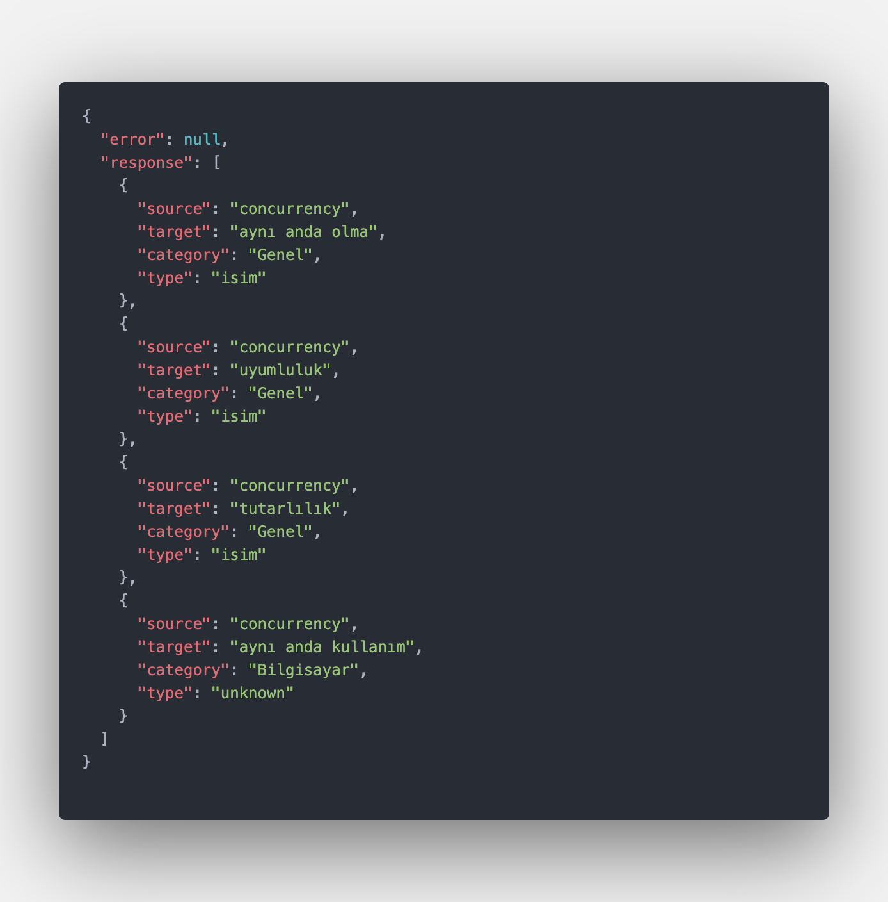

# tureng-api

Simple Tureng.com API written by Golang. The API parsing Tureng.com and serve
data into json format.

## Dependencies

The API uses [Go Query](https://github.com/PuerkitoBio/goquery).

## Installation

To use tureng-api package, you need to install Go and set your Go workspace
first.

1. Clone the project

```sh
$ git clone  https://github.com/gokhanamal/tureng-api
```

2. Open project directory

```sh
$ cd tureng-api
```

3. Download the depencencies

```sh
$ go mod download
```

4. Run the API

```sh
$ go run main.go
```

5. Open `localhost:8080` in your browser.

### Example Request

```sh
http://localhost:8080/translate?phrase=concurrency
```

Output

```
{
 "source" : Given phrase (turkish/english)
 "target" : Meaning of the given phrase (turkish/english)
 "category: Category of the phrase in Turkish
 "type": Type of the given phrase. Exp. "isim, fiil, zarf"
}
```


